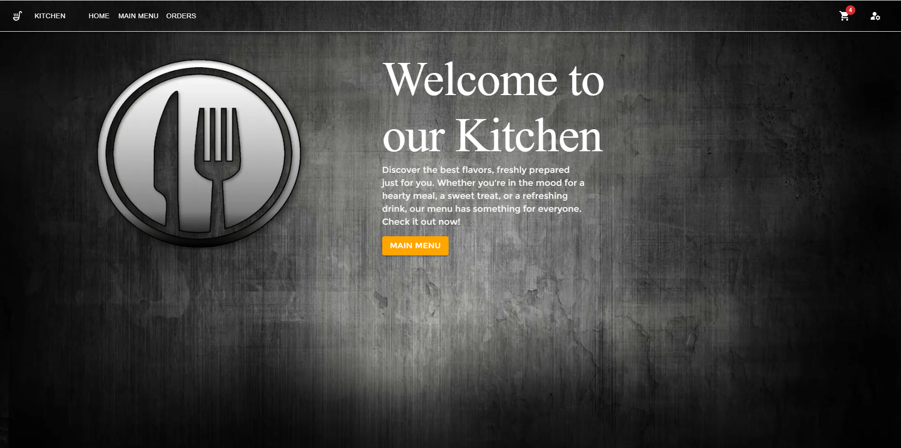
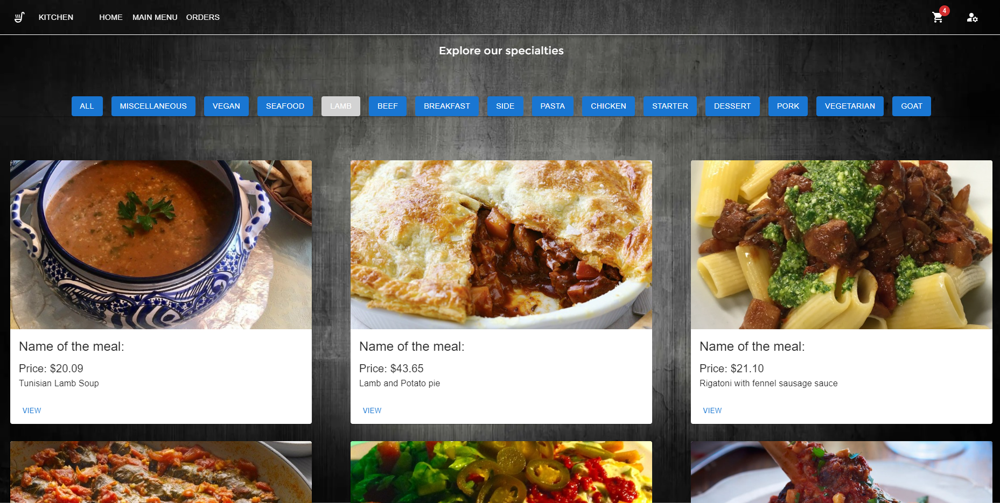
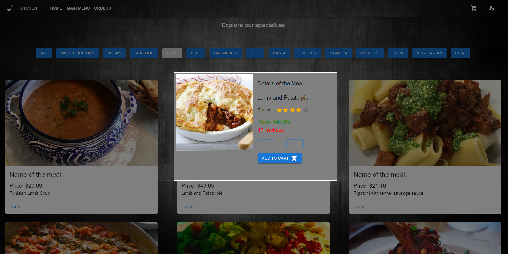
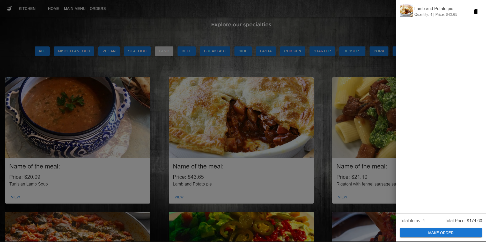
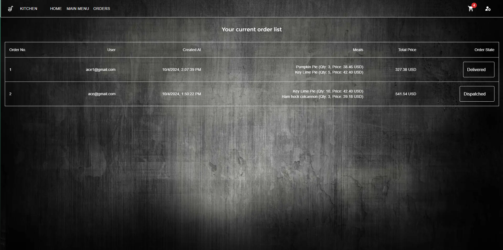
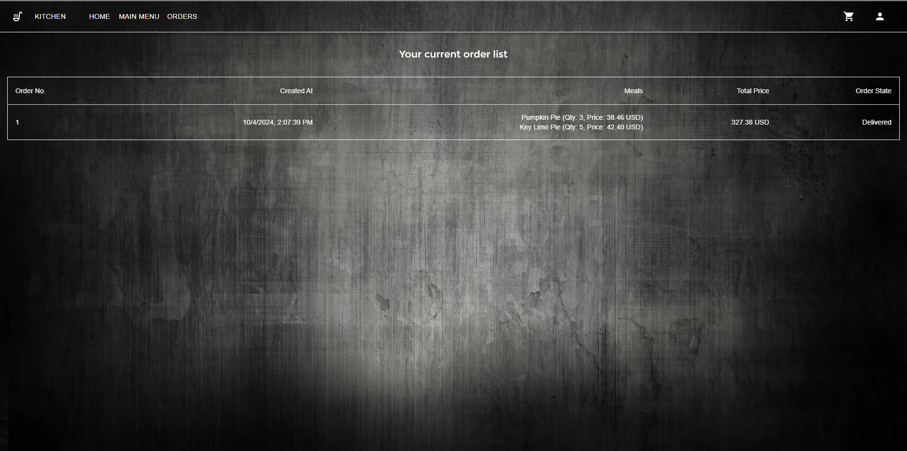

### Full stack Kitchen Web App

#### About

Kitchen is full stack web application for ordering different types
of meals based on their categories. The interactivity is simple,
viewing all the meals, filtering by the category, adding to shopping cart,
making orders.

#### Technologies

- The meals at the beginning are being fetched from [TheMealDB API](https://www.themealdb.com/api.php)
- Frontend framework: **Next.js**
- Backend framework: **Nest js**
- Authentication & JWTs: **Firebase Auth**
- Database: **Cloud Firestore Database**

#### Installation - Docker

1. Clone this repository: ``git clone https://github.com/AceGjorgjievski/Kitchen.git``
2. Open the folder with your IDE.
3. Open docker desktop
4. Navigate to the backend folder and create ``.env`` file as specified in the 
  ``.env_backend_sample.txt`` file
5. Navigate to the frontend folder and create ``.env`` file as specified in the
   ``.env_frontend_sample.txt`` file
6. If you have completed the steps above, open terminal and navigate to the root folder``cd: Kitchen``
7. Write: ``docker-compose up --build``
8. In your browser, open [localhost:3000](http://localhost:3000) and test the app.

#### Pictures

1. Home page:
   
2. Main menu with categories:
   
3. Viewing the meal:
   
4. Viewing the shopping cart:
   
5. Order page for admin user:
   
6. Order page for normal user:
   

